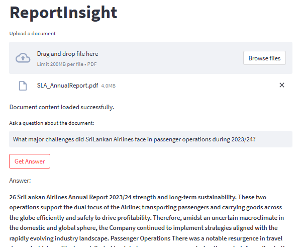

# RAG Pipeline for Annual Report Analysis



## Features
- **PDF Document Upload**:  
  Upload and analyze PDF documents to extract text content for question-answering.

- **Question-Answering System**:  
  Pose questions about the content of uploaded PDFs and receive accurate, concise answers based on the document context.

- **Page-Based Answer Referencing**:  
  Retrieves answers along with page numbers, helping users locate the exact source of the information in the document.

- **OpenAI-Powered Language Model**:  
  Utilizes the OpenAI API for advanced language processing, generating detailed and context-aware answers.

- **Text Splitting for Efficient Processing**:  
  Leverages LangChain's `RecursiveCharacterTextSplitter` to handle large text content, breaking it into manageable chunks with overlap for context retention.

- **In-Memory Vector Store with OpenAI Embeddings**:  
  Uses an in-memory vector space for fast, efficient retrieval and processing of text chunks using OpenAI embeddings, ideal for projects requiring temporary data storage.

- **Flexible System Prompt for Contextual Answering**:  
  Configured with a custom system prompt to ensure answers are concise, contextual, and sourced accurately, even when data is unavailable.

- **Streamlit-Based User Interface**:  
  A user-friendly, interactive web application for uploading documents, asking questions, and displaying results in real time.

- **Environment Variable Integration**:  
  Securely manages API keys and sensitive configurations using `.env` files, making deployment safer and more scalable.

## Installation
1. Clone this repository to your local machine using:
   ```bash
   git clone https://github.com/HiumiDayarathne/RAG_Report_Analysis.git

2. Navigate to the project directory:
   ```bash
   cd code
   
3. Install the required dependencies using pip:
   ```bash
   pip install -r requirements.txt

4. Set up your OpenAI API key by creating a .env file in the project root and adding your API
   ```bash
   OPENAI_API_KEY=your_api_key_here

## Usage/Examples

1. Run the Streamlit app by executing:
   ```bash
   streamlit run main.py

2. The web app will open in your browser.
   - You can input PDFs directly.
   - You can ask a question and get the answer based on the document.

## Project Structure
- **main.py**: The main Streamlit application script.
- **requirements.txt**: A list of required Python packages for the project.
- **.env**: Configuration file for storing your OpenAI API key.
